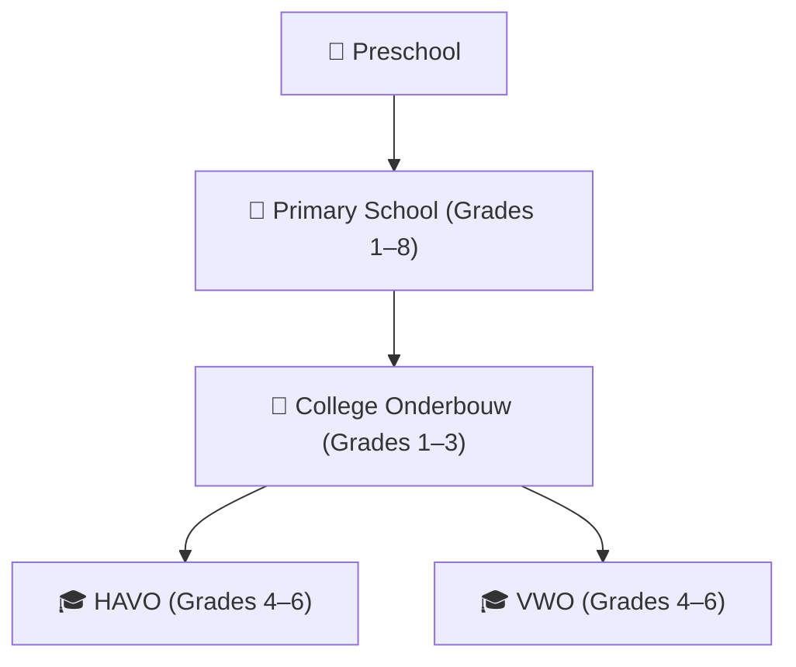

# 🧱 De Hoeksteen Basisschool & College

Welcome to the official GitHub organization of **De Hoeksteen – Basisschool & College**, an educational institution in Paramaribo, Suriname. We provide high-quality education at both the **primary** and **secondary** levels.

Our secondary school (College) offers a full **6-year academic program** with pathways to both **HAVO and VWO** diplomas, preparing students for professional studies and university education.

---

## 📚 About Our Education Programs

### 🌱 Basisschool
A supportive environment focused on foundational learning, personal growth, and academic readiness.  
🔗 [hoeksteen.sr/basisschool](https://hoeksteen.sr/basisschool)

### 🎓 College – HAVO & VWO Program
De Hoeksteen College offers a complete 6-year academic curriculum (Grades 1–6), structured as follows:

#### ▸ Lower Level (Leerjaar 1–3)
A broad foundation in:
- Dutch, English, Math, Natural Sciences
- Social Studies, Arts & Culture, Physical Education

#### ▸ Upper Level (Leerjaar 4–6)
Students follow one of four academic **profiles**, used in both HAVO and VWO systems:

- **NT** – Nature & Technology  
- **NG** – Nature & Health  
- **EM** – Economics & Society  
- **CM** – Culture & Society  

All students also take core subjects such as Dutch, English, CKV, Social Studies, and PE.

Additional elective modules include:  
*Programming, Journalism, Sustainability, Psychology*

Graduates can advance to **higher professional education (HBO)** with a HAVO diploma, or to **university preparation (WO)** via the VWO track.

🔗 [hoeksteen.sr/college](https://hoeksteen.sr/college)

---

## 📬 Contact

- 🌐 Website: [hoeksteen.sr](https://hoeksteen.sr)  
- 📧 Email: contact@hoeksteen.sr
- 🏢 Address: Keizerstraat 114, Paramaribo, Suriname

